# [📈 Live Status](https://upptime.github.io/upptime): <!--live status--> **🟧 Partial outage**

This repository contains the open-source uptime monitor and status page for [Upptime](https://upptime.js.org), powered by [Upptime](https://github.com/upptime/upptime).

With [Upptime](https://upptime.js.org), you can get your own unlimited and free uptime monitor and status page, powered entirely by a GitHub repository. We use [Issues](https://github.com/upptime/upptime/issues) as incident reports, [Actions](https://github.com/Randomness8546/upptime-8546513546545641235478/actions) as uptime monitors, and [Pages](https://upptime.github.io/upptime) for the status page.

<!--start: status pages-->
<!-- This summary is generated by Upptime (https://github.com/upptime/upptime) -->
<!-- Do not edit this manually, your changes will be overwritten -->
<!-- prettier-ignore -->
| URL | Status | History | Response Time | Uptime |
| --- | ------ | ------- | ------------- | ------ |
|  [Google](https://www.google.be) | 🟩 Up | [google.yml](https://github.com/Randomness8546/upptime-8546513546545641235478/commits/HEAD/history/google.yml) | 

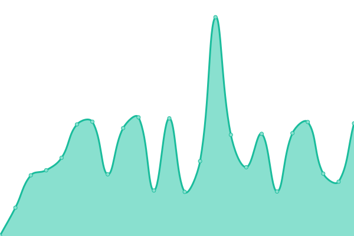 260ms
     
 | 

<a href="https://Randomness8546.github.io/upptime-8546513546545641235478/history/google">100.00%</a>
    

|  Live Odoo - Web | 🟩 Up | [live-odoo-web.yml](https://github.com/Randomness8546/upptime-8546513546545641235478/commits/HEAD/history/live-odoo-web.yml) | 

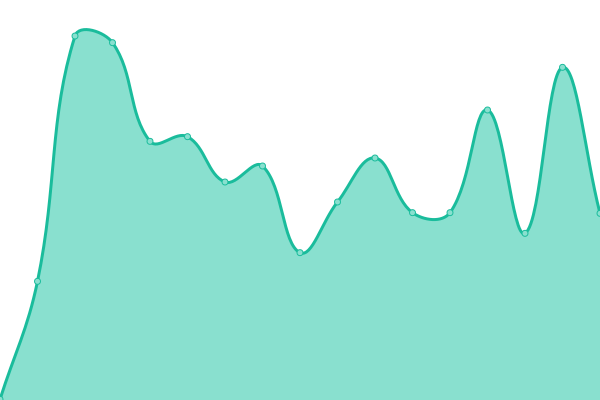 354ms
     
 | 

<a href="https://Randomness8546.github.io/upptime-8546513546545641235478/history/live-odoo-web">99.72%</a>
    

|  Live Odoo - Websocket | 🟥 Down | [live-odoo-websocket.yml](https://github.com/Randomness8546/upptime-8546513546545641235478/commits/HEAD/history/live-odoo-websocket.yml) | 

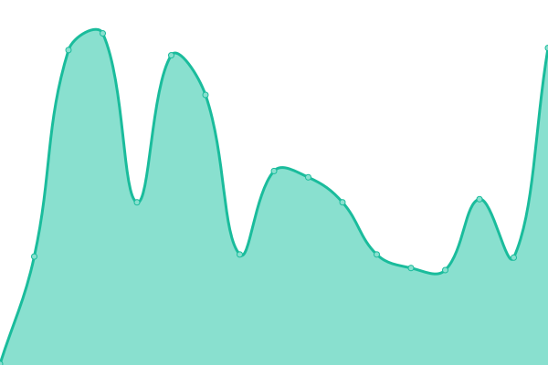 180ms
     
 | 

<a href="https://Randomness8546.github.io/upptime-8546513546545641235478/history/live-odoo-websocket">81.75%</a>
    

|  Live Odoo - Database | 🟩 Up | [live-odoo-database.yml](https://github.com/Randomness8546/upptime-8546513546545641235478/commits/HEAD/history/live-odoo-database.yml) | 

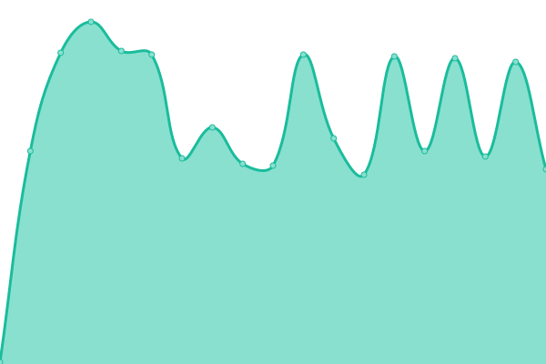 142ms
     
 | 

<a href="https://Randomness8546.github.io/upptime-8546513546545641235478/history/live-odoo-database">99.72%</a>
    

|  Acc Odoo - Web | 🟩 Up | [acc-odoo-web.yml](https://github.com/Randomness8546/upptime-8546513546545641235478/commits/HEAD/history/acc-odoo-web.yml) | 

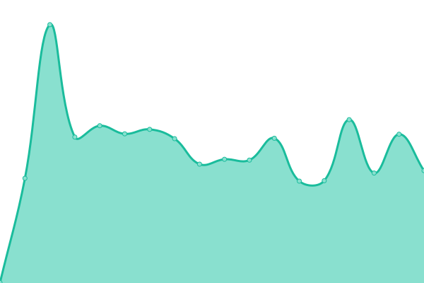 352ms
     
 | 

<a href="https://Randomness8546.github.io/upptime-8546513546545641235478/history/acc-odoo-web">100.00%</a>
    

|  Acc Odoo - Websocket | 🟥 Down | [acc-odoo-websocket.yml](https://github.com/Randomness8546/upptime-8546513546545641235478/commits/HEAD/history/acc-odoo-websocket.yml) | 

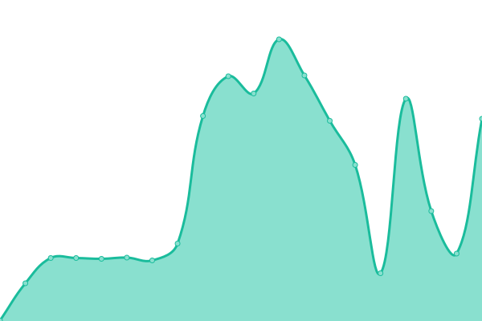 354ms
     
 | 

<a href="https://Randomness8546.github.io/upptime-8546513546545641235478/history/acc-odoo-websocket">1.26%</a>
    

|  Acc Odoo - Database | 🟩 Up | [acc-odoo-database.yml](https://github.com/Randomness8546/upptime-8546513546545641235478/commits/HEAD/history/acc-odoo-database.yml) | 

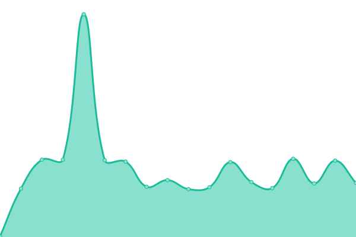 157ms
     
 | 

<a href="https://Randomness8546.github.io/upptime-8546513546545641235478/history/acc-odoo-database">100.00%</a>
    

|  Sandbox Odoo - Web | 🟩 Up | [sandbox-odoo-web.yml](https://github.com/Randomness8546/upptime-8546513546545641235478/commits/HEAD/history/sandbox-odoo-web.yml) | 

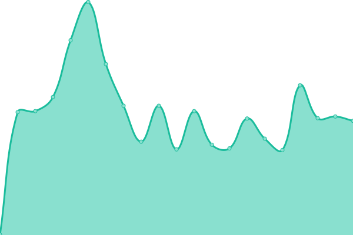 380ms
     
 | 

<a href="https://Randomness8546.github.io/upptime-8546513546545641235478/history/sandbox-odoo-web">100.00%</a>
    

|  Sandbox Odoo - Websocket | 🟥 Down | [sandbox-odoo-websocket.yml](https://github.com/Randomness8546/upptime-8546513546545641235478/commits/HEAD/history/sandbox-odoo-websocket.yml) | 

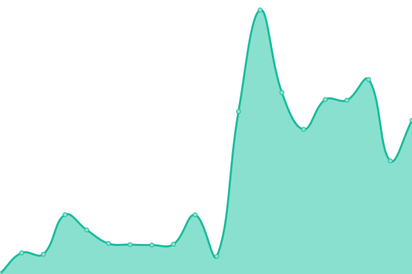 491ms
     
 | 

<a href="https://Randomness8546.github.io/upptime-8546513546545641235478/history/sandbox-odoo-websocket">0.00%</a>
    

|  Sandbox Odoo - Database | 🟩 Up | [sandbox-odoo-database.yml](https://github.com/Randomness8546/upptime-8546513546545641235478/commits/HEAD/history/sandbox-odoo-database.yml) | 

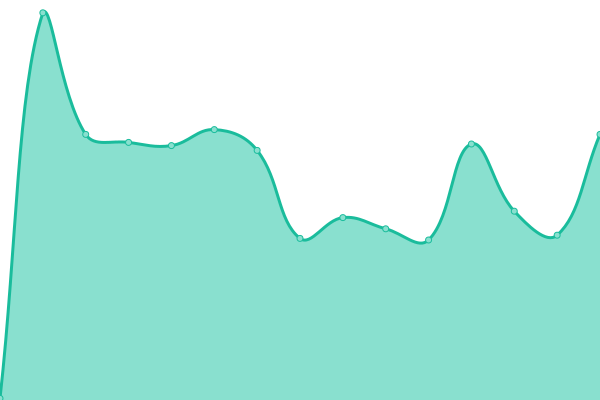 144ms
     
 | 

<a href="https://Randomness8546.github.io/upptime-8546513546545641235478/history/sandbox-odoo-database">100.00%</a>
    

|  [BTG](vpn.bontexgeo.com) | 🟩 Up | [btg.yml](https://github.com/Randomness8546/upptime-8546513546545641235478/commits/HEAD/history/btg.yml) | 

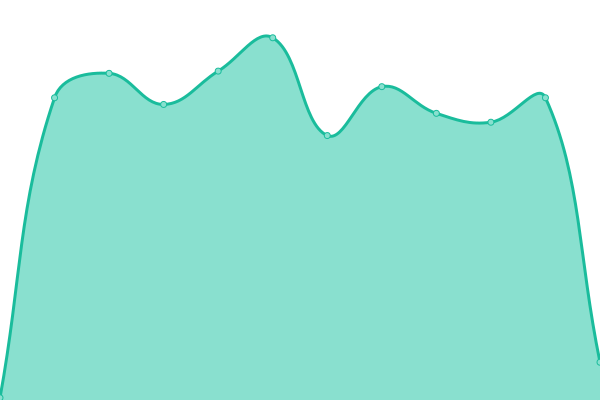 127ms
     
 | 

<a href="https://Randomness8546.github.io/upptime-8546513546545641235478/history/btg">99.53%</a>
    

|  [ABG](vpn.abgltd.com) | 🟩 Up | [abg.yml](https://github.com/Randomness8546/upptime-8546513546545641235478/commits/HEAD/history/abg.yml) | 

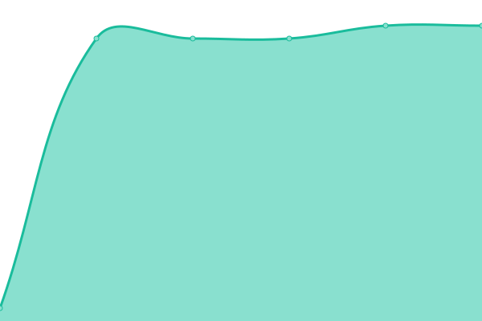 22ms
     
 | 

<a href="https://Randomness8546.github.io/upptime-8546513546545641235478/history/abg">0.01%</a>
    

|  [GTN](vpn.geotexan.com) | 🟩 Up | [gtn.yml](https://github.com/Randomness8546/upptime-8546513546545641235478/commits/HEAD/history/gtn.yml) | 

 48ms
     
 | 

<a href="https://Randomness8546.github.io/upptime-8546513546545641235478/history/gtn">99.78%</a>
    

|  [TGO](vpn.terageos.com) | 🟩 Up | [tgo.yml](https://github.com/Randomness8546/upptime-8546513546545641235478/commits/HEAD/history/tgo.yml) | 

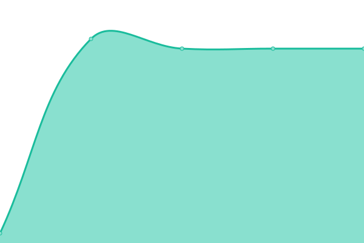 21ms
     
 | 

<a href="https://Randomness8546.github.io/upptime-8546513546545641235478/history/tgo">100.00%</a>
    

|  [STX](vpn.stratex.ch) | 🟩 Up | [stx.yml](https://github.com/Randomness8546/upptime-8546513546545641235478/commits/HEAD/history/stx.yml) | 

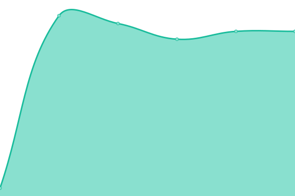 23ms
     
 | 

<a href="https://Randomness8546.github.io/upptime-8546513546545641235478/history/stx">100.00%</a>
    

<!--end: status pages-->

[**Visit our status website →**](https://upptime.github.io/upptime)

## 📄 License

- Powered by: [Upptime](https://github.com/upptime/upptime)
- Code: [MIT](./LICENSE) © [Anand Chowdhary](https://anandchowdhary.com), supported by [Pabio](https://pabio.com)
- Data in the `./history` directory: [Open Database License](https://opendatacommons.org/licenses/odbl/1-0/)
